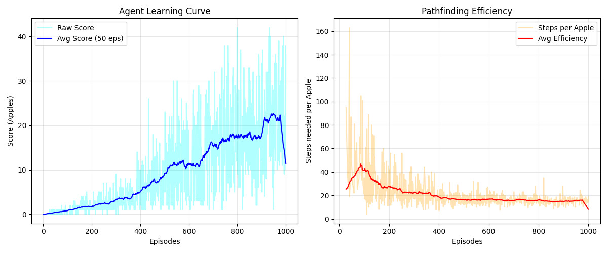

# Tabular Q-Learning: Mathematical Deep Dive

## Overview

Tabular Q-Learning is a **model-free** reinforcement learning algorithm that learns the optimal policy by maintaining a lookup table of Q-values (Quality values) for every state-action pair.

Unlike Deep Reinforcement Learning (which uses Neural Networks), this agent uses a mathematical table to "remember" the value of every possible move in every possible situation.

## 1. The Core Concept

The goal of the agent is to learn a policy $\pi$ that tells it the best **Action** $(a)$ to take for any given **State** $(s)$.

It does this by maintaining a **Q-Table** (Quality Table), a matrix of size $2048 \times 3$.

- **Rows (2048):** Represents every unique configuration of the environment the snake can see.
- **Columns (3):** Represents the actions: `[Straight, Right Turn, Left Turn]`.
- **Values:** The "score" or expected future reward for taking that action in that state.

## 2. The Mathematics (Bellman Equation)

The agent updates the Q-Table using the **Bellman Equation**. This formula allows the agent to learn from its mistakes and successes retroactively.

$$Q^{new}(s, a) \leftarrow Q(s, a) + \alpha \cdot \left[ R + \gamma \cdot \max_{a'} Q(s', a') - Q(s, a) \right]$$

Where:

- $Q(s, a)$: The current "trusted" value of taking action $a$ in state $s$.
- $\alpha$ (**Alpha**): The **Learning Rate**. How much we overwrite old knowledge with new information.
- $R$ (**Reward**): The immediate feedback from the environment (+10 for food, -10 for death).
- $\gamma$ (**Gamma**): The **Discount Factor**. How much we care about _future_ rewards versus immediate ones.
- $\max_{a'} Q(s', a')$: The best possible score we think we can get from the _next_ state $s'$.

### Breaking Down the Equation

The Bellman equation can be understood as:

$$\text{New Estimate} = \text{Old Estimate} + \text{Learning Rate} \times \text{Error}$$

Where the **Error** (also called TD Error - Temporal Difference Error) is:

$$\text{Error} = \underbrace{R + \gamma \cdot \max_{a'} Q(s', a')}_{\text{Target (what we observe)}} - \underbrace{Q(s, a)}_{\text{Current estimate}}$$

This tells us how wrong our current estimate was compared to what we actually experienced.

## 3. The State Space (Inputs)

A raw $20 \times 20$ grid has $400^{100}$ possibilities (each cell can be empty, snake body, or food, across the entire snake length); far too many for a simple table. We compress the world into **11 Boolean Sensors**.  
This reduces the state space to $2^{11} = 2048$ unique states.

The State Vector is a list of 11 `0`s and `1`s:

### Danger Sensors (3 features)

1. **Danger Straight**: Is there a wall or body part directly in front?
2. **Danger Right**: Is there a wall or body part to the right relative to the head?
3. **Danger Left**: Is there a wall or body part to the left relative to the head?

### Direction Sensors (4 features)

4. **Moving Left**: Is the snake currently facing West?
5. **Moving Right**: Is the snake currently facing East?
6. **Moving Up**: Is the snake currently facing North?
7. **Moving Down**: Is the snake currently facing South?

### Food Location Sensors (4 features)

8. **Food Left**: Is the apple x-coordinate < head x-coordinate?
9. **Food Right**: Is the apple x-coordinate > head x-coordinate?
10. **Food Up**: Is the apple y-coordinate < head y-coordinate?
11. **Food Down**: Is the apple y-coordinate > head y-coordinate?

**Example:**  
If the snake is moving **Up**, there is a **Wall on the Left**, and the **Apple is above**, the vector looks like:  
`[0, 0, 1, 0, 0, 1, 0, 0, 0, 1, 0]`

This binary vector is then converted to a decimal index (0-2047) to access the Q-Table row.

## 4. Hyperparameters

These values in [config.py](../config.py) control the learning behavior.

| Parameter           | Symbol           | Value   | Explanation                                                                                                                       |
| ------------------- | ---------------- | ------- | --------------------------------------------------------------------------------------------------------------------------------- |
| **Learning Rate**   | $\alpha$         | `0.1`   | A lower value means the agent learns slowly but stably. A high value makes it unstable.                                           |
| **Discount Factor** | $\gamma$         | `0.9`   | High importance on future rewards. The agent learns that "moving towards food" is good because it leads to "eating food" later.   |
| **Epsilon (Start)** | $\epsilon$       | `1.0`   | Probability of choosing a **random action**. We start at 100% random (Exploration).                                               |
| **Epsilon Decay**   | -                | `0.995` | After every game, we multiply $\epsilon$ by this. Over time, the agent stops exploring and starts using its brain (Exploitation). |
| **Min Epsilon**     | $\epsilon_{min}$ | `0.01`  | We always keep a 1% chance of randomness to prevent getting stuck in loops.                                                       |

### Why These Values?

**Learning Rate (α = 0.1):**

- Too high (>0.5): Overwrites old knowledge too quickly, unstable learning
- Too low (<0.01): Takes forever to learn, might never converge
- 0.1 is a sweet spot: Learns steadily without forgetting

**Discount Factor (γ = 0.9):**

- γ = 0: Only cares about immediate reward (myopic)
- γ = 1: Treats future rewards equally to immediate ones
- 0.9: Values a reward 3 steps away at 0.9³ ≈ 0.73 of its actual value

**Epsilon Decay (0.995):**

- After 1000 episodes: ε ≈ 0.006 (almost pure exploitation)
- Gradual transition from exploration to exploitation

## 5. Decision Making (Epsilon-Greedy Strategy)

The agent does not always choose the best known move. It uses an **Epsilon-Greedy** strategy to balance curiosity with performance.

1. Generate a random number $r$ between 0 and 1.
2. **If $r < \epsilon$ (Explore):** Pick a random action (Straight, Left, or Right). This helps discover new strategies.
3. **If $r > \epsilon$ (Exploit):** Query the Q-Table for the current state row and pick the action with the highest value.

$$\text{Action} = \arg\max_{a} Q(s, a)$$

### The Exploration-Exploitation Tradeoff

This is one of the fundamental challenges in RL:

- **Exploration:** Try new actions to discover better strategies
- **Exploitation:** Use known good actions to maximize reward

Early training (ε = 1.0): 100% exploration, learning the environment  
Mid training (ε = 0.5): Balanced exploration and exploitation  
Late training (ε = 0.01): 99% exploitation, refined strategy

## 6. The Reward Function ($R$)

In Reinforcement Learning, the agent does not have a teacher telling it "turn left." Instead, it takes an action and receives a numerical **Reward** from the environment. The agent's sole purpose is to maximize the total sum of these rewards.

We use a technique called **Reward Shaping** to guide the snake towards the desired behavior.

### The Values

| Event                 | Reward Value | Purpose                                                                                                                                                                  |
| --------------------- | ------------ | ------------------------------------------------------------------------------------------------------------------------------------------------------------------------ |
| **Eat Food**          | **+10**      | **Positive Reinforcement:** This is the primary goal. We give a large positive number so the agent learns that state configurations leading to food are highly valuable. |
| **Collision (Death)** | **-10**      | **Negative Reinforcement:** Hitting a wall or itself is the worst possible outcome. This penalty teaches the agent to avoid "Dangerous" states.                          |
| **Move (Empty Step)** | **0**        | **Neutral/Efficiency:** Currently, we give 0 for simply surviving.                                                                                                       |

### Why These Numbers? (The "Credit Assignment" Problem)

If we only gave a reward of `+1` for food and `-1` for death, the agent might not distinguish clearly between a "great move" and a "tragic mistake."

- **Magnitude Matters:** The reward for eating (+10) must be high enough to justify the risk of moving.
- **The Horizon:** Because our **Discount Factor ($\gamma$)** is 0.9, the agent realizes that a move _now_ that leads to food _3 steps later_ is worth:

$$\text{Reward} \approx 0 + (0.9 \times 0) + (0.9^2 \times 0) + (0.9^3 \times 10) \approx 7.29$$

This mathematical "scent" draws the snake toward the apple.

### Common Pitfalls We Avoided

1. **The Cowardly Agent:** If we set the death penalty too high (e.g., `-10,000`), the agent might simply freeze or spin in a safe circle forever, afraid to explore.
2. **The Looping Agent:** If we gave `+1` just for staying alive, the agent would learn to ignore the food and just move in circles to farm "survival points" indefinitely. By making the food reward dominant (+10), we force goal-oriented behavior.
3. **The Impatient Agent:** If we used γ = 0.1, the agent would only value immediate rewards and might make reckless moves.

## 7. Performance Metrics

**1. Learning Curve (Total Score)**

- **What it measures:** The number of apples eaten per episode.
- **Success Indicator:** The trend line should go **UP**.
- **Interpretation:** Early episodes start near 0 (random movement). As the Q-Table fills, the agent survives longer and accumulates higher rewards.

**2. Pathfinding Efficiency (Steps per Apple)**

- **What it measures:** The average number of moves required to secure one point of reward.
- **Success Indicator:** The trend line should go **DOWN**.
- **Interpretation:** This separates "Intelligence" from "Luck." If the score is high but this metric stays high, the snake is just wandering randomly until it hits food. If this metric drops, the agent is actively optimizing its path (learning navigation).

### Sample Training Metrics (After 1000 Episodes)

## 8. Convergence Guarantees

Under the following conditions, Q-Learning is **guaranteed** to converge to the optimal policy:

1. All state-action pairs are visited infinitely often
2. Learning rate satisfies: $\sum_{t=1}^{\infty} \alpha_t = \infty$ and $\sum_{t=1}^{\infty} \alpha_t^2 < \infty$
3. Rewards are bounded
